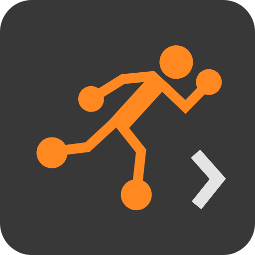
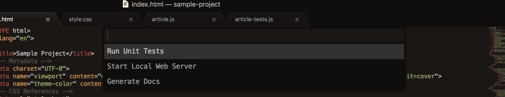
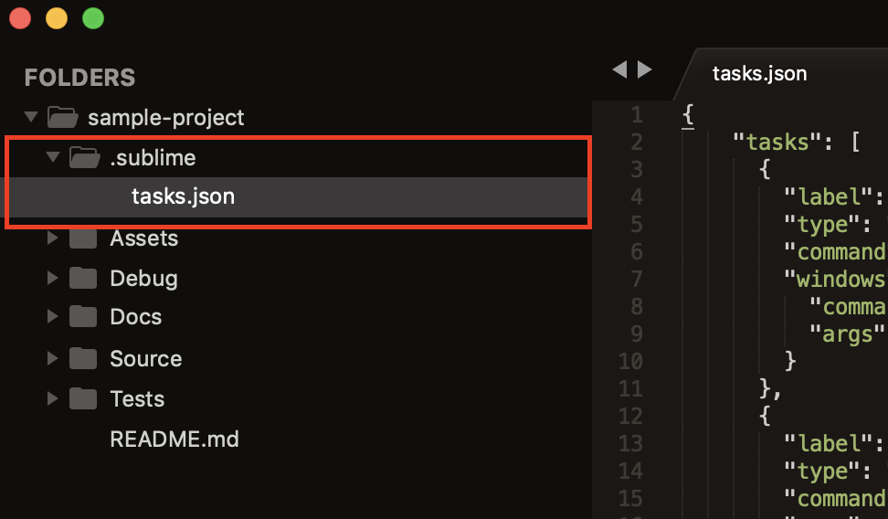

# Sublime Run Task

[](./LICENSE)
[](https://www.sublimetext.com/3)

Run automated workspace tasks from Sublime Text 3 quick panel. With Run Task you can configure a list of commonly used workspace tasks, such as running unit tests and code generation, and be able to run them and analyze their results without having to leave your favorite text editor.

<p align="center">
    
</p>

## Installation

### Manual

Run Task package can be installed manually by cloning this Git repository into your Sublime Text packages installation directory. Please note that by selecting this installation method any package updates will have to be installed manually.

* Open a terminal in Sublime Text packages installation directory. A path to this directory can be found through `Preferences` &rarr; `Browse Packages...`.
* Run 
	```
	git clone https://github.com/mgutski/sublime-run-task "Run Task"
	```

## Usage

Open or create the `.sublime-project` file, which is the file that contains your project definition. 

<p>
    
</p>

Add `Run Task.tasks` top level section with JSON tasks definitions, as in the example below.

```json
{
    "folders":
    [
        {
            "path": ".",
            "folder_exclude_patterns": [".idea", ".vscode"],
            "file_exclude_patterns": [".gitignore", ".gitattributes", ".gitmodules", ".firebaserc"]
        }
    ],
    "settings":
    {
        "tab_size": 4
    },
    "Run Task.tasks": 
    [
        {
            "name": "Run Unit Tests",
            "type": "shell",
            "command": "./Tests/run_unit_tests.sh",
            "windows": {
                "command": "wsl",
                "args": "./Tests/run_unit_tests.sh"
            }
        },
        {
            "name": "Start Local Web Server",
            "type": "shell",
            "command": "osascript",
            "args": "-e 'tell app \"Terminal\" to activate' -e 'tell app \"Terminal\" to do script \"cd ${cwd} && ./Debug/run-http-server.sh\"'",
            "windows": {
                "command": "cmd",
                "args": "/C start cmd /K .\\\\Debug\\\\run-http-server.cmd"
            },
            "show_output_panel": false
        },
        {
            "name": "Generate Docs",
            "type": "shell",
            "command": "./Source/scripts/generate_docs.sh",
            "windows": {
                "command": "wsl",
                "args": "./Source/scripts/generate_docs.sh"
            }
        }
    ]
}
```

Apart from shell commands, Run Task also supports running Sublime Text window commands. For example, for a task that launches a terminal, one may want to use a `open_terminal_project_folder` window command from [Terminal](https://github.com/wbond/sublime_terminal) package. This can be achieved with the following task definition:

```json
{
    "name": "Start Local Web Server",
    "type": "sublime",
    "command": "open_terminal_project_folder",
    "args": {
        "parameters": ["/C", ".\\Debug\\run-http-server.cmd"]
    }
}
```

That's all there is to it. You can now conveniently access your custom tasks from anywhere in your project, either by running `Run Task` command from command palette, or using a [key binding](#key-bindings).

### Task Properties

Run Task supports the following set of task properties and values:

| Property           | Required | Type                     | Value                                               |
|--------------------|----------|--------------------------|-----------------------------------------------------|
| name              | YES      | string                   | The task's name displayed in Sublime's quick panel. |
| type               | YES      | string                   | The task's type. It can either be `shell` or `sublime`. If `shell` is specified, the `command` is interpreted as a shell command to execute. If `sublime` is specified, the `command` is interpreted as a Sublime Text window command to execute. |
| command            | YES      | string                   | The command to execute. It must be a valid shell command or Sublime Text window command name, depending on the `type` specified. For the shell commmand to work, the specified executable must be in your _PATH_. |
| args               | NO       | string, array, or object | The arguments to be passed to the `command`. For a task of type `shell` it can either be a string or array. For a task of type `sublime` it must be a JSON object. |
| windows            | NO       | object                   | The Windows-specific `command` and `args` properties. If specified, the supplied properties will be used when the task is executed on Windows operating system. |
| show_output_panel  | NO       | boolean                  | Defines whether the `shell` task output is to be printed to Sublime's output panel. |

### Variable Substitution

Run Task supports variable substitution for tasks of type `shell`. The substitutable variables can be used with `command` and `args` properties of task definition.

Supported variables:

| Variable           | Substituted Value                                               |
|--------------------|-----------------------------------------------------------------|
| cwd                | The workspace directory path.                                   |

Example:

```json
{
    "name": "Variable Substitution Test",
    "type": "shell",
    "command": "./Debug/script.sh",
    "args": ["CWD:", "${cwd}"],
    "windows": {
        "command": "${cwd}\\Debug\\script.cmd",
        "args": ["CWD:", "${cwd}"]
    }
}
```

## Key Bindings

The package comes with some pre-defined keyboard shortcuts. You can always configure your own shortcuts via `Preferences` &rarr; `Package Settings` &rarr; `Run Task` &rarr; `Key Bindings`.

| Command         | Linux & Windows  | macOS                  |
|-----------------|------------------|------------------------|
| Run Task        | `Ctrl`+`Alt`+`R` | `Ctrl`+`Option`+`R`    |

## Credits

Run Task features are highly inspired by [Visual Studio Code Tasks](https://code.visualstudio.com/docs/editor/tasks).

## License

This project is licensed under the MIT License. See the [LICENSE](./LICENSE) file for details.
